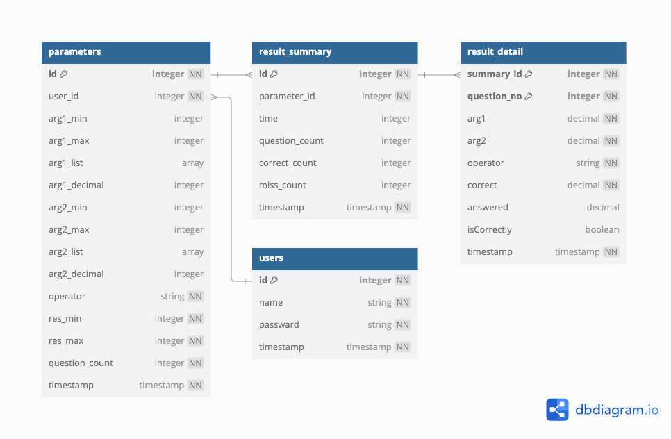

# けいさんアプリ
こども向けの計算学習アプリの開発リポジトリです。

# アプリ概要
たし算・ひき算・かけ算を学習できます。
計算で使う値の最小値・最大値や出題数などをパラメータ設定できる事が特徴です。

# 使用方法
以下、ターミナルで実行してください。※他にもありそう。後で確認😳
- バックエンド設定
1. npm install
2. psql postgres
    create database keisan;
3. npm run db:migrate
4. npm run start
5. .envファイルに環境変数入力
- フロントエンド設定
1. cd frontend
2. npm install
3. npm run dev
 http://localhost:5173/ からアプリを開いてください。

# データベース
4つのデータテーブルを使用しています。
- users: ユーザー管理
- parameters： 計算で使うパラメータ管理
- result_summary： 学習1回あたりの記録
- result_detail： 学習詳細の記録

# 使用技術

 

 
 

# 環境
| 言語・フレームワーク       | バージョン   |
|------------------|---------|
| express          | 4.21.1  |
| knex             | 3.1.0   |
| dotenv           | 16.4.5  |
| axios            | 1.7.7   |
| React               | 18.3.1 |

# 今後の予定
- 小数点の計算を追加
- わり算を追加
- 過去問題の学習を追加
- ミスした問題の再学習を追加
- 結果分析グラフを追加
- 学習によるポイント加算機能を追加
- ユーザー登録・ログイン機能を追加

20244/11/13